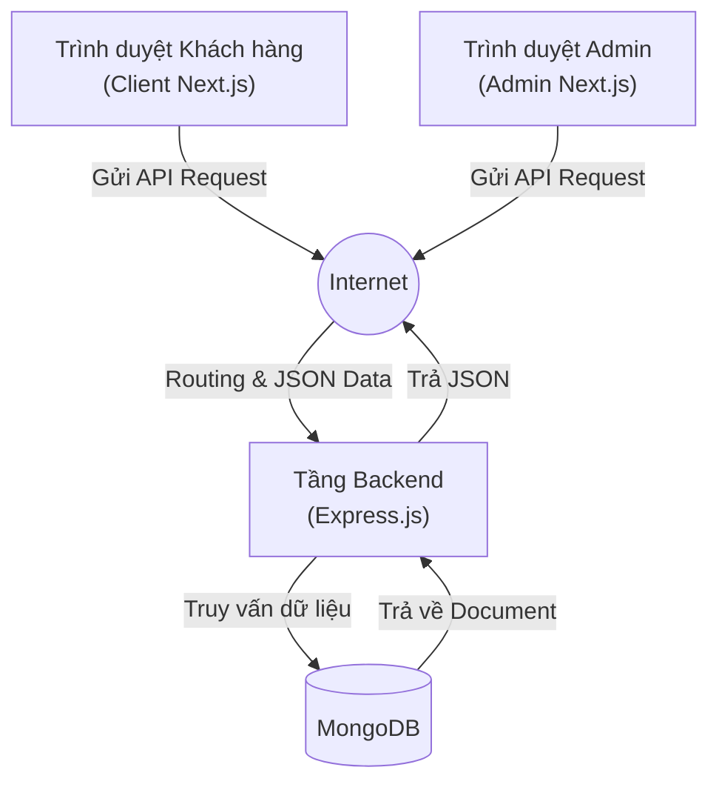

# 🏗️ SYSTEM ARCHITECTURE OVERVIEW

> Tài liệu mô tả bức tranh tổng thể về kiến trúc dự án Cake Shop, sơ đồ luồng dữ liệu (Data Flow) và tổ chức mã nguồn (Source Organization).

---

## 1. 🌟 Kiến trúc Tổng quan (High-Level Architecture)

Dự án Cake Shop tuân theo kiến trúc **Mô hình Client-Server** dựa trên RESTful API để phân tách rõ ràng trách nhiệm giữa Frontend và Backend, từ đó dễ dàng mở rộng, bảo trì và deploy độc lập.



- **Frontend (Tầng giao diện):** Chạy trên môi trường Client (Trình duyệt) thông qua Server-Side Rendering (SSR) & Client-Side Rendering (CSR) của Next.js.
- **Backend (Tầng xử lý logic & dữ liệu):** Nhận request, xác thực danh tính (Authentication), kiểm tra quyền hạn (Authorization), xử lý nghiệp vụ, giao tiếp với CSDL và trả về kết quả chuẩn định dạng JSON.
- **Database (Tầng lưu trữ):** Cơ sở dữ liệu NoSQL (MongoDB) để lưu trữ linh hoạt thông tin sản phẩm (Cakes), đơn hàng (Orders) và người dùng (Users).

---

## 2. 🗂️ Tổ chức Mã nguồn (Source Organization)

Để quản lý toàn bộ hệ thống thuận lợi nhất, source code đang được tổ chức theo mô hình **Mono-repo** đơn giản bằng thư mục gốc.

```text
/<workspace>
├── /docs/                # Tài liệu kỹ thuật, PRD, Architecture, Idea
├── /web-client/          # Source Code của Frontend (Next.js)
│   ├── /admin            # App độc lập dành cho Quản trị viên
│   └── /user             # App độc lập dành cho Khách hàng
│       ├── /app          # Nơi chứa các màn hình hiển thị (Next.js App Router)
│       ├── /modules      # Nơi chứa Mọi logic theo tính năng (Hooks, API, UI Component)
│       └── ... 
└── /web-server/          # Source Code của Backend (Vanilla Express.js)
    ├── app.js            # Nơi cấu hình Express Server gốc
    ├── /schemas          # Nơi định nghĩa cấu trúc DB Mongoose
    ├── /routes           # Định tuyến API
    ├── /controllers      # Hứng Request và trả về JSON
    ├── /services           # Chuyên xử lý Logic Nghiệp vụ hạng nặng
    └── ...
```

---

## 3. 🚨 Hệ thống Xử lý Lỗi Toàn cục (Global Error Handling)

Để hệ thống không bao giờ bị "màn hình trắng" (Crash) và người dùng luôn hiểu tại sao không thao tác được, xử lý lỗi được cài đặt xuyên suốt xuyên biên giới từ Rễ tới Bề mặt theo nguyên tắc Cánh Cửa (Funnel Pattern):

```mermaid
graph LR
    DB[("MongoDB / Mongoose lỗi")] -->|"Throw Error"| SVC["Tầng Backend Service"]
    SVC -->|"Chuyển lỗi"| CTRL["Tầng Backend Controller"]
    CTRL -->|"Đẩy qua hàm next()"| MW["Global Error Middleware"]
    MW -->|"Đóng gói hình hài JSON chuẩn 400/500"| NET["NetWork Response"]
    NET -->|"Phát hiện Status bị sai"| HTTP["Frontend HTTP/Axios Interceptor"]
    HTTP -->|"Tung ApiError"| RQ["React Query onError"]
    RQ -->|"Kích hoạt Message UI"| UI["Ant Design Toast Alert"]
```



1. **Backend Lọc Lỗi (Phễu):**  Bất chấp là lỗi mất mạng DB, lỗi rớt hàm, lập trình viên code sai... Mọi lỗi đều bị Middleware cuối cùng (`error-handler.js`) chụp lại. Nó sẽ bóp toàn bộ nùi lỗi hỗn độn đó thành 1 định dạng duy nhất trước khi trả về: `{ error: { code: 400, message: "Yêu cầu sai" }}`. Không bao giờ để lộ Stacktrace Node.js cho Frontend thấy.
2. **Frontend Trình Diễn Lỗi (Phễu):** Ở Client, cửa khẩu `lib/http.ts` tóm gọn mọi Response có mã `>= 400`. Nó quăng Exception. React Query đứng nấp sẵn ở App Layout tóm lấy mọi Exception, và kích hoạt Lệnh bung Bảng thông báo nhỏ gọn của Ant Design (Toast). Nhờ đó, người Code UI không phải chia tay rẽ nhánh If/else xem có lỗi không, mà chỉ cần lo viết Code khi Mọi thứ Thành Công.

### 3.1. Bảng mã Trạng thái Tiêu chuẩn (Standard HTTP Status Codes)
Quy ước ép buộc cho mọi phản hồi từ Express Backend, Frontend sẽ dùng đúng mã này để quyết định có quăng lỗi Toast hay không:

* **✅ Thành công (Success - 2xx):**
  - `200 OK`: Trả về khi lấy data thành công hoặc cập nhật (`PUT`/`DELETE`) ok.
  - `201 Created`: Trả về Độc Quyền cho hành động Tạo mới (`POST`) (Ví dụ: Thêm Bánh mới, Tạo Order mới).

* **❌ Lỗi Client (Client Error - 4xx):**
  - `400 Bad Request`: Validation sai (Thường bị Joi/Zod chặn do bỏ trống field `name`, `email`...). Hoặc sai logic nghiệp vụ (Kiểu "Hết bánh").
  - `401 Unauthorized`: Token JWT hết hạn, hoặc chưa đăng nhập. Frontend ngửi thấy `401` sẽ tự Clear Token và chuyển trang về `/login`.
  - `403 Forbidden`: Mất quyền (Ví dụ một thằng `role: user` định mò vào tạo mới Cake).
  - `404 Not Found`: API URL không tồn tại, hoặc Mongoose báo gắp không ra cái Id Bánh này `findById = null`.

* **☠️ Lỗi Server (Server Error - 5xx):**
  - `500 Internal Server Error`: Backend sập/Lỗi code JS/Lệnh Mongoose hỏng. (Lúc này `error-handler` sẽ chặn lại và xuất `"Có lỗi xảy ra từ Máy chủ"` để giấu dốt).

---

> Các cấu trúc kiến trúc con đi vào chi tiết kĩ thuật được mô tả tại: 
> 1. [Kiến trúc Frontend](./2_frontend_architecture.md)
> 2. [Kiến trúc Backend](./3_backend_architecture.md)
