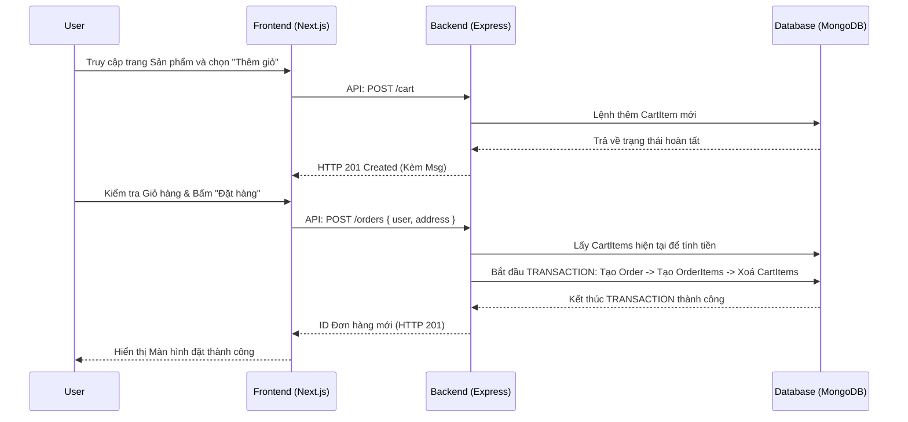
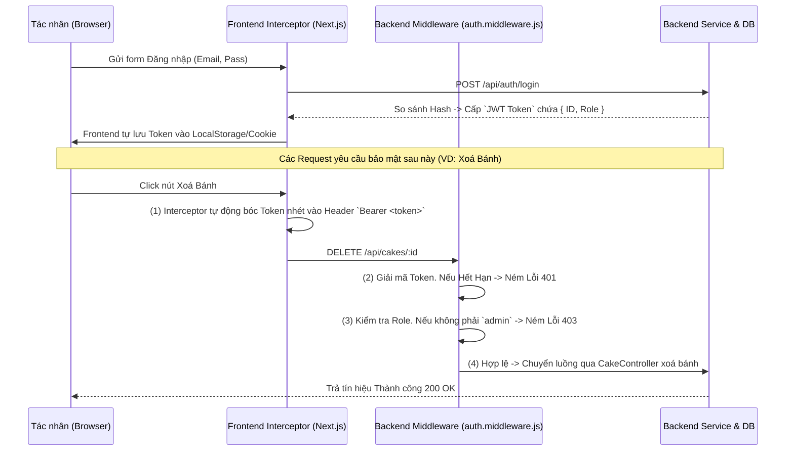

# 🔄 BUSINESS CONTEXT & DATA FLOWS

> Tài liệu này chuyên mô tả chi tiết các Luồng dữ liệu nghiệp vụ (Business Data Flows) và Trình tự Giao tiếp (Sequence Diagrams) giữa các thành phần của hệ thống.

---

## 1. 🔗 Luồng truyền thông dữ liệu cơ bản (Basic Request Lifecycle)
Bất kỳ một tương tác nào của User cũng đi theo luồng chuẩn sau:

1. **Client Action:** Người dùng click, nhập thông tin trên UI (VD: Thêm vào giỏ hàng, Đăng nhập).
2. **State Update / Pre-validate:** Frontend kiểm tra dữ liệu đầu vào. Nếu hợp lệ, lưu vào UI State tạm thời và kích hoạt API.
3. **API Requesting:** Fetch/Axios gửi HTTP Request đóng gói tiêu đề (Headers) cùng Token tới Backend.
4. **Backend Validation:** Backend quét chốt chặn bằng các middleware (Chặn JWT Auth, kiểm tra Role, kiểm tra Schema với Zod/Joi). 
5. **Business Logic:** Backend Controller chuyển Request qua Service tương ứng để tính toán và lấy dữ liệu Mongoose định danh gửi tới MongoDB.
6. **API Response:** Backend trả về thông điệp lỗi dạng JSON chuẩn hoá.
7. **Client Feedback:** Frontend nhận dữ liệu, xử lý Side-effect (Hiện thông báo Toast hoặc chuyển hướng URL).

---

## 2. 🛒 Flow Mua hàng (E-Commerce Checkout Flow)
Dưới đây là Sequence Diagram minh hoạ luồng tương tác quan trọng nhất trên hệ thống từ lúc giỏ hàng tới lúc đặt mua:

---

## 3. 🔐 Flow Xác thực và Phân quyền (Auth & Role Flow)
Quy trình đảm bảo an ninh cho hệ thống, đặc quyền API (đặc biệt đối với kênh `admin`):

---

## 4. 📦 Flow Xử lý Đơn hàng (Admin Order Fulfillment Flow)
Toàn bộ Vòng đời sống (Lifecycle) của một Đơn hàng được mô tả thực tế dựa theo PRD:

1. **Trạng thái PENDING:** Mặc định của Đơn hàng khi User vừa đặt xong (`Flow số 2`). Đơn hàng chưa được quản trị viên đụng tới.
2. **Trạng thái CONFIRMED:** Admin đăng nhập trang Dashboard `web-client/admin`. Admin click chọn nút "Xác nhận Đơn". Hàm gọi API `PATCH /api/orders/:id/status` với body `{ status: 'CONFIRMED' }`. 
3. **Trạng thái DONE:** Shipper (tùy định nghĩa) giao hàng thành công, Admin thao tác cập nhật Status cuối cùng là `DONE`. Vòng đời hoá đơn kết thúc.
4. **Trạng thái REJECTED:** Hệ thống sụp tiệm / khách bom hàng / khách gọi điện nhờ xoá. Admin có quyền thủ công huỷ đơn đưa về `REJECTED`. Bản ghi không bao giờ bị lệnh `DELETE` cứng xoá khỏi cơ sở dữ liệu.
